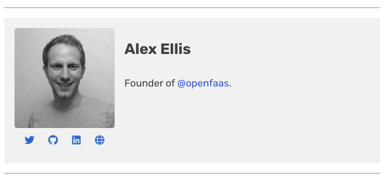

# OpenFaaS Website and Blog

This repository contains the OpenFaaS webpage and blog - https://www.openfaas.com, created using Jekyll and a modified fork of the [CloudCannon Frisco template](https://github.com/CloudCannon/frisco-jekyll-template) and built/hosted using Github Pages.

## Contributing

The following sections provide a basic guide to some common changes that will be made to the site, adding posts, authors etc.

### Editorial / style guidelines

#### Post structure

All blog posts must have a title *and* description, this helps with SEO. Author's name could be mentioned in the description.

Format:

* Short intro/overview (150 words)

* Series of logical steps or points / topics

Embed conceptual diagram, video or picture to help make case.

* Call to action

Point to Docs/GitHub or something else.

* Acknowledgements

If necessary show acknowledgements to others who collaborated or gave feedback you used. When working on GitHub this is available in public history, so use sparingly.

#### Voice

* Headings

When using steps use the active/imperative voice for headings.

Good:

* "Get started"
* "Configure the node"

Bad:

* "Getting started"
* "Configuring the node"

#### Use Plain English

English is widely spoken, but is not the first language of all readers. This publication also covers many technical topics, you may be an expert, but your readers are unlikely to be, so consider both of these when you write your article. 

Write in plain English at all times, when a simpler word exists use it, avoid words derived from Latin when possible, avoid gerunds where an active verb can replace it.

If you are writing an article, then your voice should be coming across, and your experience. That is why you are writing the post - try to avoid using passive tense or statements, where you can use a sentence that starts with `I`.

Before:

* In any production service, logs are a critical component of observability and debuggability of the system

After:

* Logs are critical to observing and debugging systems once in production.
* Logs are critical to observing and debugging production systems.

Use short sentences:

Before: 

* This should ease your debugging experience with functions and the combination with Grafana also opens some additional possibilities, for example you can start creating dashboards for your functions that combine Prometheus metrics _and_ logs on the same screen by using the [new logs panel

After: 

* The combination of Loki and Grafana make it even easier to debug functions than before. You can even create dashboards that combine function metrics and logs in one place.

For some additional recommendations see:

* [This post](https://www.cs.uky.edu/~raphael/writing.html), by Raphael A. Finkel, University of Kentucky.

* And [Before & After]http://www.plainenglish.co.uk/campaigning/examples/before-and-after.html] from plainenglish.co.uk

#### Tone / style

* Be objective, avoid being "cute"

Whilst using fun terms like "Boom!", "Fun and profit" and making jokes in text, can work well on a personal blog. The OpenFaaS blog and documentation should have a minimal use of this kind of "fun" or "cute" terms.

* Opinion vs. facts

Opinions should be presented as your own viewpoint. If you have data to back-up your position, this will help make your point credible. If you have no data, then make sure the reader understands this by relating to yourself `I believe that ..`, `I found it easier to ..`

If you are stating a fact / objective data, you should also back this up with quotes, links, etc.

* Quote your sources

Beware of copyright laws. If you use a diagram or embed a quote from somewhere, make sure you give it [proper attribution](https://en.wikipedia.org/wiki/Attribution_(copyright)).

#### Images

Place all images in a sub-folder `./images/<post-name>`

* Add a background post

Each post should have a background photo picked from free stock photography or provided with a Creative Commons license. Do not pull images in from Google without checking that the usage / license is valid first. Crop the background to a width of 1600 pixels. Use JPEG and aim for 200Kb-280Kb in size when exporting (increase compression)

You can decrease the size further by limiting the "quality" of the JPEG from 100% to something lower like 70-75%.

* [Pexels](https://www.pexels.com)
* [Unsplash](https://unsplash.com)

* In-post images and screenshots

Each blog post should have at least one conceptual diagram. This should show the logical flow or abstract view of the feature, news or design. An embedded Tweet or video could also serve this purpose.

Images are important for every post, but try to compress / crop the images as much as is reasonable and possible. This will help mitigate the huge size a GitHub repo can grow to which is full of images.

#### Cross-posting content

Cross-posting content negatively affects SEO scores, so should not be done unless additional care and attention is made to include the required "og" headers. Make sure all content on the OpenFaaS community blog is original.

### Developing locally

A Docker Compose file is provided to simplify developing/contributing to the website and blog, this has been verified to work on both OSX and Windows 10 (when developing/writing on Windows please use Unix line endings in your editor).

Run the site locally with:

    docker-compose up

This will make the site available locally at - http://localhost:4000.

    Starting openfaas-www_openfaas-jekyll_1 ... done
    Attaching to openfaas-www_openfaas-jekyll_1
    openfaas-jekyll_1  | ruby 2.5.1p57 (2018-03-29 revision 63029) [x86_64-linux-musl]
    openfaas-jekyll_1  | Configuration file: /srv/jekyll/_config.yml
    openfaas-jekyll_1  |             Source: /srv/jekyll
    openfaas-jekyll_1  |        Destination: /srv/jekyll/_site
    openfaas-jekyll_1  |  Incremental build: disabled. Enable with --incremental
    openfaas-jekyll_1  |       Generating...
    openfaas-jekyll_1  |       Remote Theme: Using theme cloudcannon/frisco-jekyll-template
    openfaas-jekyll_1  |                     done in 3.074 seconds.
    openfaas-jekyll_1  |  Auto-regeneration: enabled for '/srv/jekyll'
    openfaas-jekyll_1  |     Server address: http://0.0.0.0:4000
    openfaas-jekyll_1  |   Server running... press ctrl-c to stop.

Any changes made to the site in your editor will be picked up inside the container and the site will be regenerated (**note** this does not include changes to `_config.yml`, you must restart the docker container to pick up those changes).

For example, if you add your own post in `_posts/2018-07-31-my-post.md` you will see Jekyll detect the change and regenerate the site, refreshing your browser will pick up any changes.

    openfaas-jekyll_1  |       Regenerating: 1 file(s) changed at 2018-07-31 21:28:36
    openfaas-jekyll_1  |                     _posts/2018-08-22-my-post.md
    openfaas-jekyll_1  |       Remote Theme: Using theme cloudcannon/frisco-jekyll-template
    openfaas-jekyll_1  |                     ...done in 2.0199265 seconds.

### Add end-user company

* Edit `_data/users.yml`
* Copy the logo in SVG or png format to `images/users-logos/`

### Landing page users

The contributors section on the landing page is being generated using a small `node` script located in the `generate-stats.js` file. It is recommended that you run this script before opening a PR. This will ensure the contributors section is up-to-date:

    node generate-stats.js

NOTE: requires [Node.js](https://nodejs.org) to be installed on your system.

### Adding an Author/Team Member

In order to have a blog post properly attributed to an author, they must be added to team by creating an `<author_name>.md` file in the `_staff_members` directory.

Display of team member on Team Page is based on position in the [data/members.yml](_data/members.yml) file.

Attribution in a blog post is based on the filename.

For example, `_staff_members/alex.md` can be used for attribution by setting the following metadata a post:

    author_staff_member: alex

Which results in an author box being displayed with each assigned post:



The author definition takes the following format:

    ---
    name: Alex Ellis
    position: Founder
    image_path: /images/author/ellis.jpg
    twitter_username: alexellisuk
    blurb: Founder of <a href="https://twitter.com/openfaas">@openfaas</a>. Open Source <a     href="https://twitter.com/vmware">@vmware</a>.
    ---

Key | Details
------------ | -------------
name | Full name of the contributing author
position | Free text description of their relationship to the project
image_path | Path to the authors portrait, this should be a 154px * 154px image
twitter_username | Authors Twitter handle (with no `@`)
blurb | Free text information about the user, this should be very short


### Contributing a post

Contributing a post is as straight forward as raising a PR containing your post in markdown format along with any embedded images.

Your post markdown should be created in the `_posts` directory and the file should take the following structure.

    yyyy-mm-dd-short-description-of-post.md

If you're in doubt take a look at the existing posts for ideas on what is acceptable.

The post consists of two parts, a [YAML Front Matter](https://jekyllrb.com/docs/frontmatter/) header which describes the post and provides Jekyll with cues for rendering/attribution etc, and the post body which is just standard Markdown.

#### YAML Front Matter

The post metadata takes the following form:

    ---
    title: Introducing the OpenFaaS Operator for Serverless on Kubernetes
    date: 2018-07-14
    image: /images/kubernetes-operator-crd/pexels-asphalt-blue-sky-clouds-490411.jpg
    categories:
      - kubernetes
    author_staff_member: alex
    canonical_url: https://blog.alexellis.io/introducing-the-openfaas-operator/
    ---


Key | Details
------------ | -------------
title | Title of the blog post
date | Publish date of the blog post in `yyyy-mm-dd` format
image | Path to image which will be displayed behind the title, this should be added in a directory with the same name as the blog post under the `images` directory.
categories | An optional list of categories which the post falls under, you should always reuse existing categories from earlier posts where feasible
author_staff_member | Name of the authors file in `_staff_members` directory, used for attribution (see previous section)
canonical_url | You **must** set this field if the blog post has already been published at another URL. Preference is given to original content.

#### Post Body

While Jekyll supports multiple formats, you should submit your post in Markdown format.

The following guide describes the syntax:

 - https://daringfireball.net/projects/markdown/

It is also very useful to compare existing posts with the underlying markdown files when you want to learn how to format your post.

Adding images uses the normal Markdown format, and while external images are possible it is preferred that you include any images in your PR, these should go in a directory with the same name as the post under the `images` directory, for example `images/kubernetes-operator-crd/`.

**Note** take care to only include sensible image sizes, you should ensure that you have resized/processed any images before adding them to your PR.

### Styling

The site uses the [SASS](https://sass-lang.com/) Stylesheet language, any alterations to the sites look and feel must be made using SASS, do not contribute raw `.css` files.

We are also using [Bulma](https://bulma.io/) as our css framework.
Before making any style changes / additions please consider:

- follow [Bulma](https://bulma.io/) guidelines
- DO NOT overwrite [Bulma](https://bulma.io/) files directly. Use custom saas files and/or variables
- make use of the declared SASS variables and mixins
- each section on the website should have its own SASS file


### Altering the Header and Footer

The site's navbar and footer are configured via YAML in the following files:

 - `_data/footer.yml`
 - `_data/navigation.yml`

Adding entries to either should be as a last resort as they must not become cluttered.

### Further Reading

For a more detailed understanding of how the site is built please refer to the Jekyll and Github Pages documentation:

 - [Jekyll Documenation](https://jekyllrb.com/docs/home/)
 - [Using Jekyll with Github Pages](https://help.github.com/articles/using-jekyll-as-a-static-site-generator-with-github-pages/)

 The site also uses the following plugins:

  - [jekyll-sitemap](https://github.com/jekyll/jekyll-sitemap)
  - [jekyll-seo-tag](https://github.com/jekyll/jekyll-seo-tag)
  - [jekyll-feed](https://github.com/jekyll/jekyll-feed)
  - [jekyll-paginate](https://jekyllrb.com/docs/pagination/)
  - [jekyll-archives](https://github.com/jekyll/jekyll-archives)

Refer to the documenation above for details on how each plugin can be used and configured.

### Generate GIF

```bash
rm -rf outg/* ; ffmpeg -i videoplayback.mp4 -vf "select='not(mod(n,2000))',setpts='N/(30*TB)'" -f image2 -y outg/out%03d.jpg

ffmpeg -f image2 -framerate 1 -i outg/out%003d.jpg  -vf "scale=width=-2:height=ih/2 " out.gif
```

